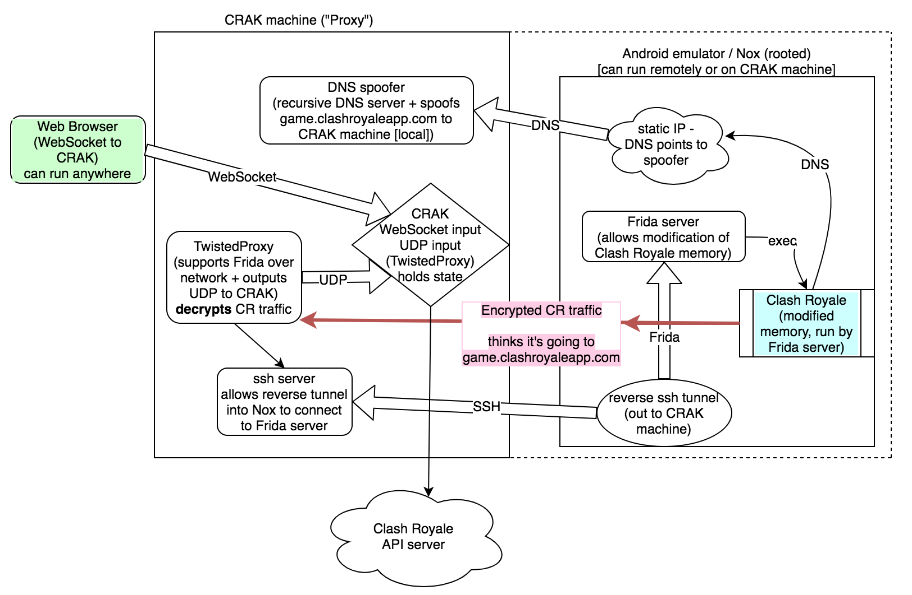

# crak
Crash Royale Attack Kit



### Installation

- Install [Nox](https://www.bignox.com/) Android emulator
- Root Nox (System Settings -> Root -> On)
- Point Android DNS to Proxy's IP (likely the IP of the machine running Nox)
  - On Android, open Settings -> Wi-Fi
  - Click and hold "WiredSSID"
  - Click Modify Network -> Show Advanced Options
  - Change "IP settings" to "Static"
  - Set "DNS 1" to IP of Proxy (eg, 192.168.0.104)
  - Click Save
  - Ensure "WiredSSID" is "Connected", otherwise connect
- Install [Samy's TwistedProxy](https://github.com/samyk/TwistedProxy)
```sh
git clone https://github.com/samyk/TwistedProxy
cd TwistedProxy/TweetnaclMod
python3 setup.py build_ext -b ../TCP
cd ..
python3 -m pip install -r requirements.txt
cd ..
```
- Configure TwistedProxy by adjusting `config.json` "Hostname" to a CR IP such as "54.201.206.14"
- Install [Samy's DNS spoofer](https://github.com/samyk/usbdriveby)
```sh
git clone https://github.com/samyk/usbdriveby
cd usbdriveby
sudo perl -MCPAN -e 'install Net::DNS'
# add *YOUR* local Proxy IP address to /etc/hosts, eg "192.168.0.104"
echo "192.168.0.104 game.clashroyaleapp.com" | sudo tee -a /etc/hosts
cd ..
```
- Install [xz](https://tukaani.org/xz/) if you don't already have it
```sh
# after downloading through annoying sourceforge links @ https://tukaani.org/xz/
tar -zxvf xz-5.2.4.tar.gz &&
cd xz-5.2.4 &&
./configure &&
make &&
sudo make install
cd ..
```
- Install [Frida-server](https://github.com/frida/frida/releases) on Nox via `adb`
```sh
wget https://github.com/frida/frida/releases/download/12.2.25/frida-server-12.2.25-android-x86.xz
xz -d frida-server-12.2.25-android-x86.xz
'/Applications/Nox App Player.app/Contents/MacOS/adb' -e push frida-server-12.2.25-android-x86 /data/local/tmp/frida-server
```

### Running the Proxy

- Run the DNS spoofer from Proxy server
  - `sudo perl usbdriveby/dns_spoofer.pl`
- Run frida-server on Nox
  - `'/Applications/Nox App Player.app/Contents/MacOS/adb' -e shell /data/local/tmp/frida-server -D`
- ***this may not be necessary, try without first*** Run reverse SSH tunnel for Frida on Nox to Proxy
  - `'/Applications/Nox App Player.app/Contents/MacOS/adb' -e shell`
  - `ssh -Nnf -R 27042:localhost:27042 remote@192.168.0.104` # adjust 192 IP to Proxy IP
- Validate Frida is communicating properly
  - `frida-ps -H 127.0.0.1`
- Run TwistedProxy on Mac (which launches Clash Royale with custom key automaticaly)
  - `python3 TwistedProxy/Main.py -a '/Applications/Nox App Player.app/Contents/MacOS/adb' -v -f -u`
- Run Crak daemon
  - `perl crak/crakd -s`
