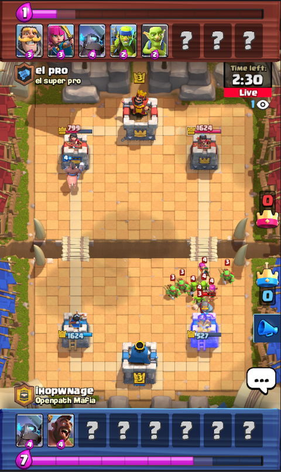

## Special configs

Current features:
- view elixir of opponent during live spectating
- incease how much confetti you can spray during spectating
- random untested/unverified changes

The "csv" files here are modified configs inside of the apk. These are lzma compressed with a very special header, including a 4-byte uncompressed length instead of an 8-byte length, 0xFFFFFFFF(FFFFFFFF) is not a supported uncompressed size (default from `xz/lzma`), and some bits before this are altered.

There is a file `/data/data/com.supercell.clashroyale/update/fingerprint.json` that includes paths to the configs and shasums, however the SHA sums don't seem to have any affect (currently). If you're running into issues, you may need to pull the file, modify the shasum to match the naughty csv, then push it back onto your device.

### Uploading "compressed" config file

Make sure to use the correct `adb`. If running from Nox:
- `'/Applications/Nox App Player.app/Contents/MacOS/adb' -e push client_globals.csv /data/data/com.supercell.clashroyale/update/csv_client/`
- Kill (if running) and start Clash Royale